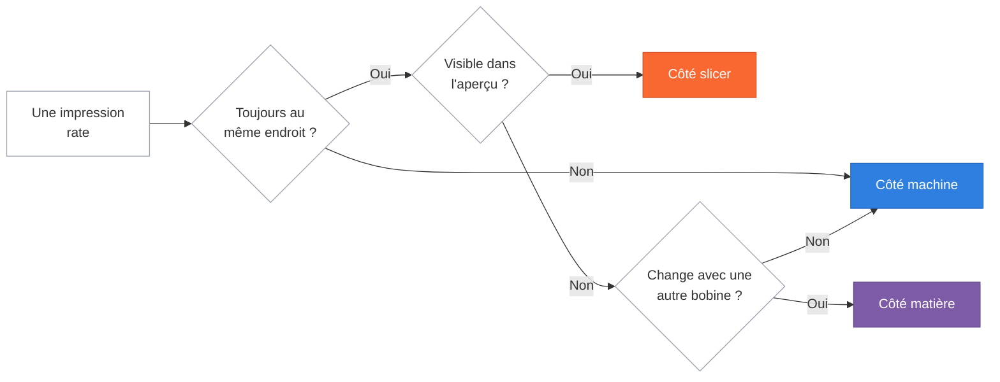

# Diagnostiquer un échec

De quel côté faut-il chercher ?

<!--
Minutage : 95-96 min. Module 7, 10 minutes.

Changer de posture ici : ce n'est plus un cours, c'est une révision. Poser les
questions à la salle avant de donner les réponses. Ils savent déjà répondre à
la plupart - c'est le but.
-->

---
module: 7 · Diagnostiquer un échec
---

# Les défauts les plus fréquents

Six défauts, trois côtés. Le symptôme, la cause, le geste qui corrige.

<DefectSide side="slicer" />

<DefectSide side="machine" />

<DefectSide side="matiere" />

<DefectCard side="slicer"
  title="Trous sur le dessus"
  symptom="La surface du dessus est grumeleuse et percée"
  cause="Les coques horizontales n'ont pas assez d'appuis pour se tendre au-dessus du remplissage."
  fix="Ajouter 2 coques horizontales, ou monter le remplissage à 20 %" />

<DefectCard side="machine"
  title="Ça ne colle pas au plateau"
  symptom="Un coin se relève, la pièce se détache"
  cause="Plateau gras, ou première couche posée trop haut. Le PLA n'accroche pas sur du gras."
  fix="Nettoyer le plateau à l'alcool, reprendre le Z-offset" />

<DefectCard side="matiere"
  title="Fils et bavures"
  symptom="Une toile d'araignée entre les parties de la pièce"
  cause="La matière coule pendant les déplacements. Le plus souvent : filament humide."
  fix="Sécher la bobine, vérifier le profil de filament" />

<DefectCard side="slicer"
  title="Surplomb qui s'affaisse"
  symptom="Le dessous d'un porte-à-faux pendouille en vagues"
  cause="Au-delà de 45°, la buse dépose dans le vide : rien ne tient la couche."
  fix="Réorienter la pièce, ou activer les supports" />

<DefectCard side="machine"
  title="Couches décalées"
  symptom="Tout l'objet est déporté à partir d'une hauteur"
  cause="Obstacle rencontré ou courroie qui a sauté. La machine a perdu sa position."
  fix="Vérifier courroies et tiges, puis relancer" />

<DefectCard side="matiere"
  title="Couches qui se séparent"
  symptom="La pièce casse net entre deux couches, sans effort"
  cause="Trop froid pour cette bobine : les couches ne se soudent pas entre elles."
  fix="Monter la buse de 5 à 10 °C, suivre la fiche de la bobine" />

Guide complet, 25 défauts illustrés :
<a href="https://www.simplify3d.com/resources/print-quality-troubleshooting/" target="_blank" rel="noopener" class="font-mono" style="color: var(--prusa-orange)">simplify3d.com/resources/print-quality-troubleshooting/</a>

<!--
Minutage : 96-102 min.

Les trois colonnes sont visibles avant le premier clic : c'est le plateau de
jeu. Poser chaque défaut comme une devinette avant de cliquer -
« La pièce se décolle. Qui a une idée ? » - et laisser la carte tomber dans
sa colonne. La position EST la réponse, pas une étiquette à lire.

Les cartes tombent côté par côté : les deux du slicer d'abord, puis les deux
de la machine, puis les deux de la matière. Une colonne se remplit entièrement
avant de passer à la suivante - on traite un côté à la fois, sans sauter.

Ils viennent de voir les cinq réglages, ils vont trouver. Chaque bonne réponse
prouve que le module 5 a marché.

Faire circuler les pièces ratées réelles au fur et à mesure. Une caisse de
ratés est le meilleur investissement pédagogique d'un fablab.

Le point à faire passer avant la slide suivante : deux défauts par côté, et
QUATRE sur six ne se corrigent pas dans le logiciel. Le slicer n'est pas le
coupable par défaut.

Deux nuances à donner à l'oral si quelqu'un les soulève :
- l'adhérence peut aussi se soigner au slicer (bordure, radeau), mais tant que
  le plateau est gras aucune bordure ne sauvera l'impression ;
- le surplomb qui s'affaisse est le seul défaut de la slide qu'on voit dans
  l'aperçu, en bleu « périmètre en surplomb » - lien direct avec le module 6.

La référence Simplify3D est en anglais mais très illustrée : chaque défaut a
sa photo. C'est la meilleure ressource à donner à quelqu'un qui bute chez lui.
-->

---
module: 7 · Diagnostiquer un échec
---

# La méthode, en trois questions

**Une seule modification à la fois, et on relance.** Changer trois réglages ensemble et voir que ça marche n'apprend rien : on ne saura jamais lequel était le bon.

<!--
Minutage : 102-105 min. Fin du module 7.

Ce petit arbre est ce qu'il faut retenir du module. Les trois issues reprennent
exactement les couleurs des colonnes de la slide précédente : orange le slicer,
bleu la machine, violet la matière. Le dire une fois, ils feront le lien seuls.

Le dérouler à voix haute sur un cas concret, par exemple une pièce qui se
décolle toujours du même coin : même endroit → oui ; visible dans l'aperçu →
non ; change avec une autre bobine → non → côté machine, plateau et Z-offset.

La règle « une modification à la fois » est la plus difficile à tenir et la
plus importante. C'est de la méthode, pas de la technique - et c'est ce qui
sépare celui qui progresse de celui qui tourne en rond.

Si la salle est encore vive, prendre une vraie pièce ratée apportée par un
participant et dérouler l'arbre ensemble. C'est la meilleure fin possible
pour ce module.
-->
