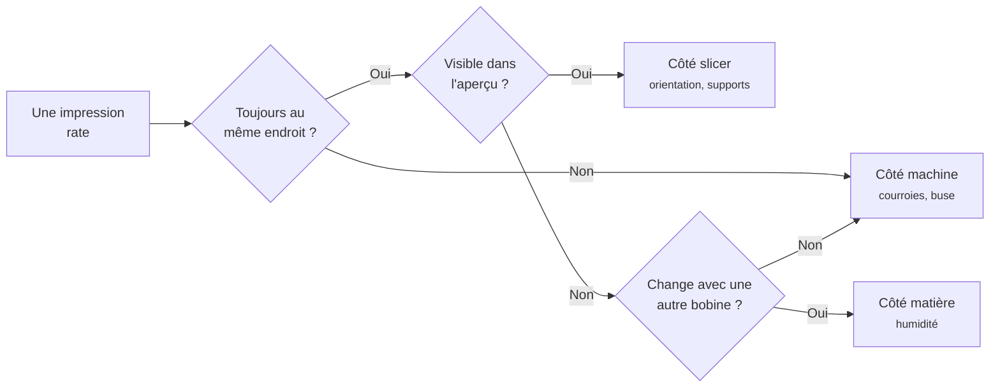

# Diagnostiquer un échec

De quel côté faut-il chercher ?

<!--
Minutage : 95-96 min. Module 7, 10 minutes.

Changer de posture ici : ce n'est plus un cours, c'est une révision. Poser les
questions à la salle avant de donner les réponses. Ils savent déjà répondre à
la plupart - c'est le but.
-->

---
module: 7 · Diagnostiquer un échec
---

# Les défauts les plus fréquents

D'après le guide de dépannage Simplify3D. Symptôme, cause, geste correctif.

<DefectCard side="slicer"
  title="Ça ne colle pas au plateau"
  symptom="Un coin se relève, la pièce se détache"
  cause="Plateau gras ou mal réglé, trop peu de surface au contact."
  fix="Nettoyer à l'alcool, vérifier le Z-offset, mettre une bordure" />

<DefectCard side="machine"
  title="Sous-extrusion"
  symptom="Traits fins, trous entre les lignes, couches incomplètes"
  cause="Buse partiellement bouchée, ou filament qui frotte."
  fix="Vérifier la bobine, nettoyage à froid de la buse" />

<DefectCard side="matiere"
  title="Fils et bavures"
  symptom="Une toile d'araignée entre les parties de la pièce"
  cause="La matière coule pendant les déplacements. Le plus souvent : filament humide."
  fix="Sécher la bobine, vérifier le profil de filament" />

<DefectCard side="slicer"
  title="Trous sur le dessus"
  symptom="La surface du dessus est grumeleuse et percée"
  cause="Les coques horizontales n'ont pas assez d'appuis pour se tendre."
  fix="Ajouter 2 coques horizontales, ou monter le remplissage à 20 %" />

<DefectCard side="matiere"
  title="Surchauffe"
  symptom="Coins arrondis, petits détails fondus, aspect affaissé"
  cause="La couche n'a pas le temps de figer. Fréquent sur les pointes."
  fix="Ventilation à fond, ou imprimer deux pièces à la fois" />

<DefectCard side="machine"
  title="Couches décalées"
  symptom="Tout l'objet est déporté à partir d'une hauteur"
  cause="Obstacle rencontré ou courroie qui a sauté. La machine a perdu sa position."
  fix="Vérifier courroies et tiges. Le slicer n'y peut rien" />

Guide complet, 25 défauts illustrés :
simplify3d.com/resources/print-quality-troubleshooting/

<!--
Minutage : 96-102 min.

Poser chaque défaut comme une devinette avant de cliquer :
« La pièce se décolle. Qui a une idée ? »
Ils viennent de voir les cinq réglages, ils vont trouver. Chaque bonne réponse
prouve que le module 5 a marché.

Faire circuler les pièces ratées réelles au fur et à mesure. Une caisse de
ratés est le meilleur investissement pédagogique d'un fablab.

Le code couleur des étiquettes porte le message du module : orange le slicer,
bleu la machine, violet la matière. Trois des six défauts ne se corrigent PAS
dans le logiciel. C'est le point à faire passer avant la slide suivante.

La référence Simplify3D est en anglais mais très illustrée : chaque défaut a
sa photo. C'est la meilleure ressource à donner à quelqu'un qui bute chez lui.
-->

---
module: 7 · Diagnostiquer un échec
---

# La méthode, en trois questions

**Une seule modification à la fois, et on relance.** Changer trois réglages ensemble et voir que ça marche n'apprend rien : on ne saura jamais lequel était le bon.

<!--
Minutage : 102-105 min. Fin du module 7.

Ce petit arbre est ce qu'il faut retenir du module. Le dérouler à voix haute
sur un cas concret, par exemple une pièce qui se décolle toujours du même coin :
même endroit → oui ; visible dans l'aperçu → oui, la base est minuscule →
côté slicer, bordure.

La règle « une modification à la fois » est la plus difficile à tenir et la
plus importante. C'est de la méthode, pas de la technique - et c'est ce qui
sépare celui qui progresse de celui qui tourne en rond.

Si la salle est encore vive, prendre une vraie pièce ratée apportée par un
participant et dérouler l'arbre ensemble. C'est la meilleure fin possible
pour ce module.
-->
